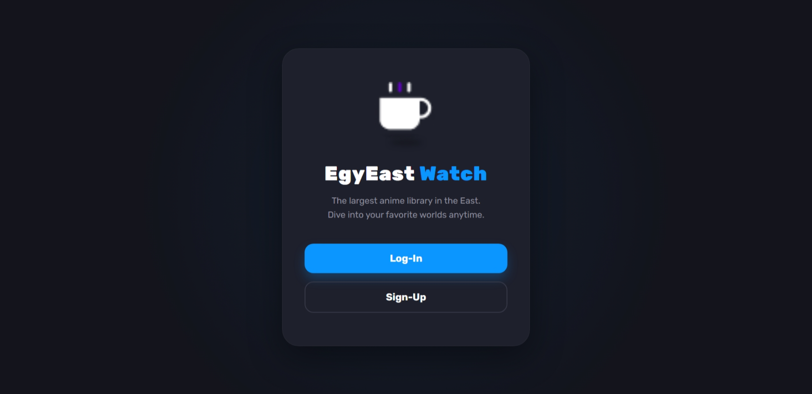
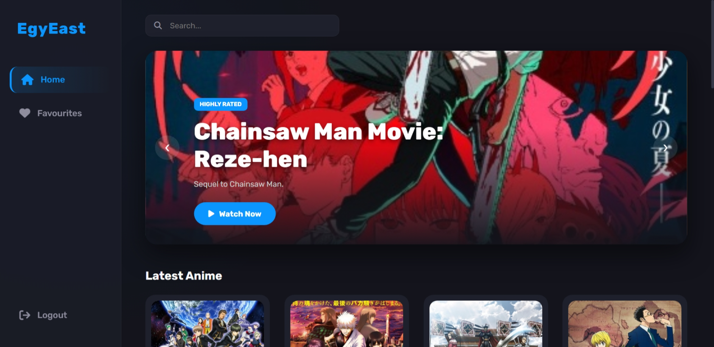
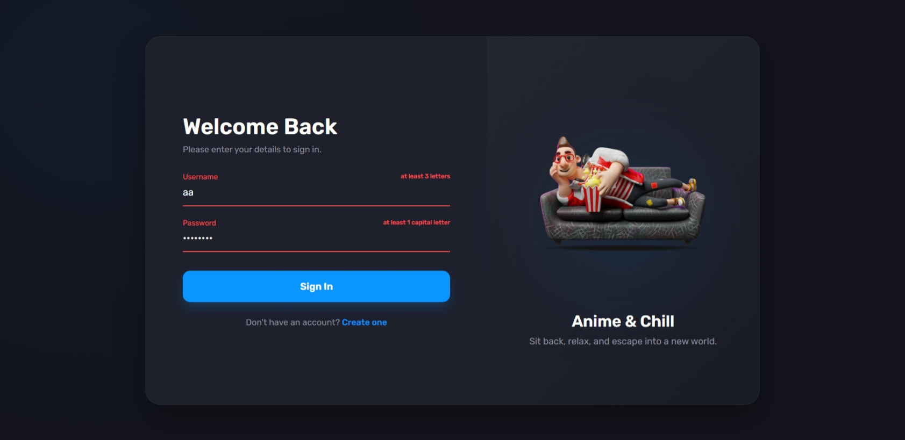
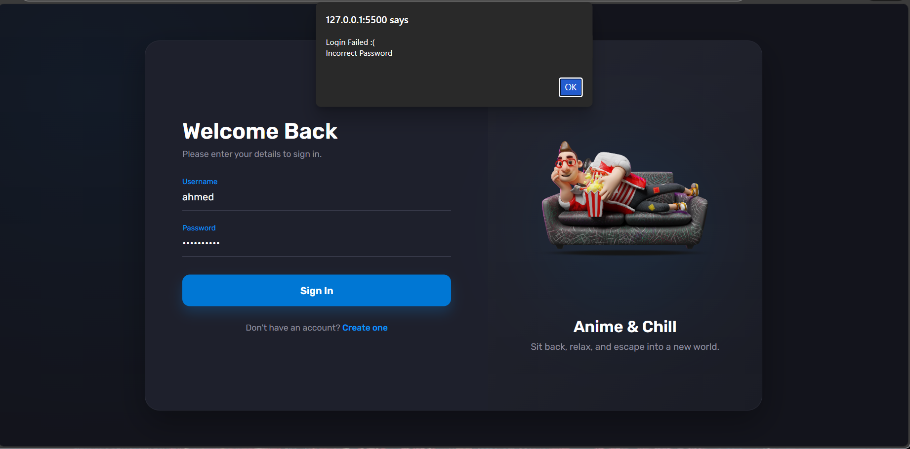
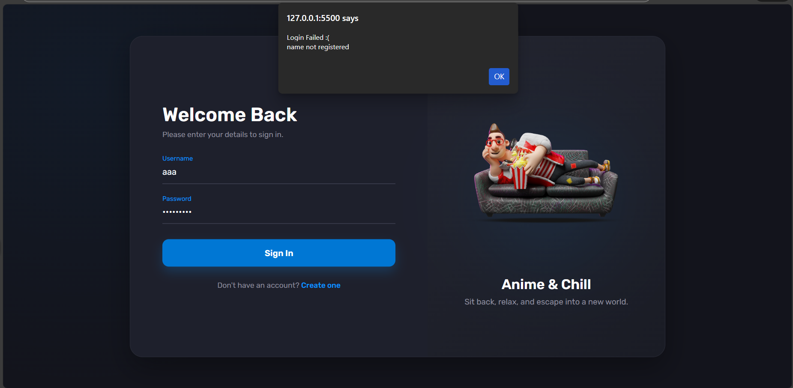
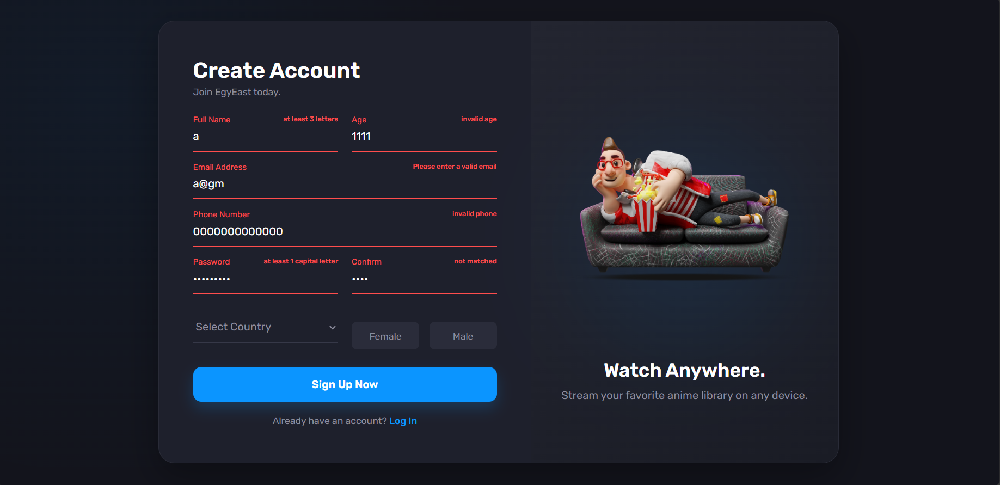
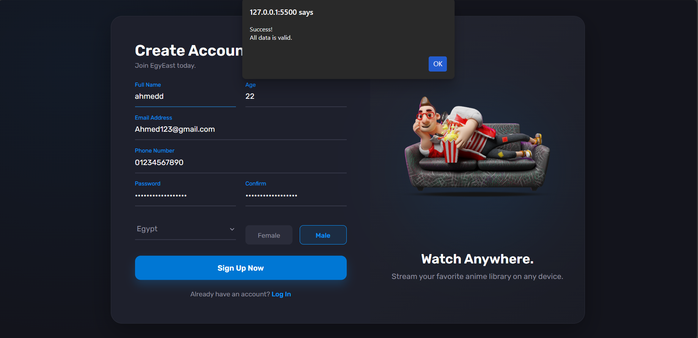
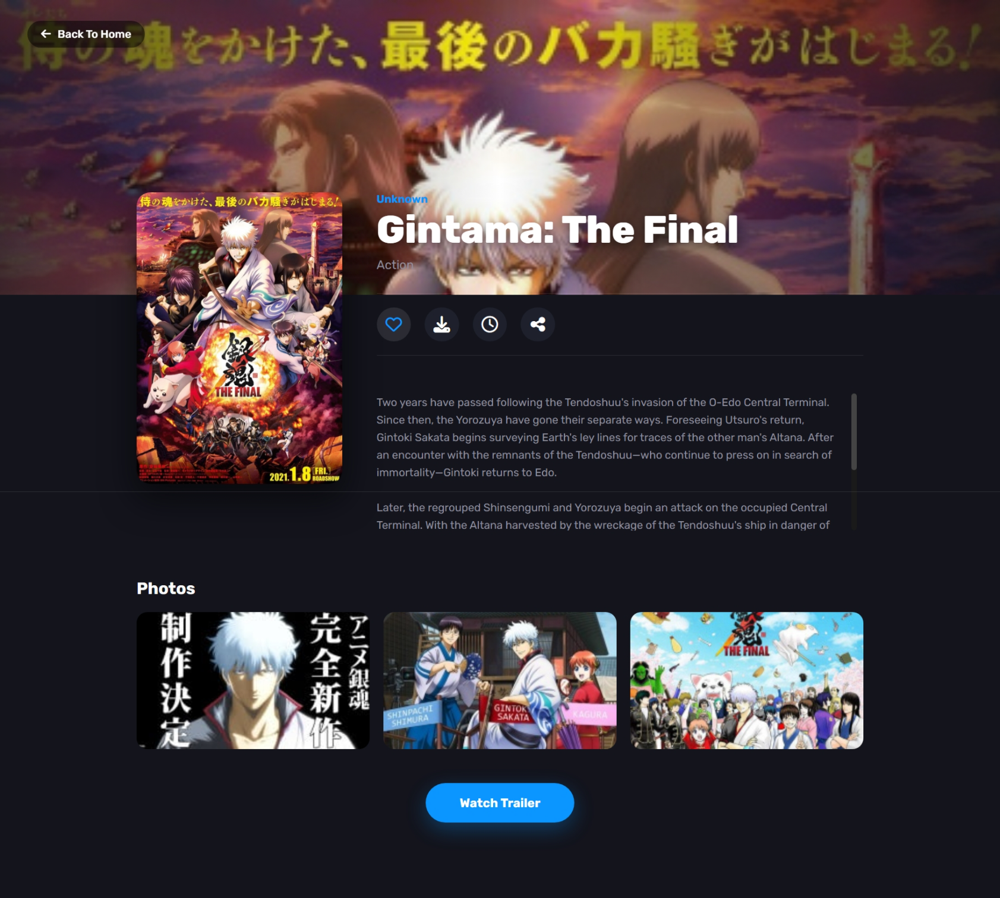
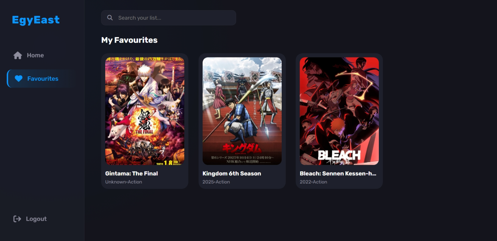

# 🎬 EgyEast Watch

  
  
  
  
   

  <h3>
    🔴 <a href="https://egy-east-js-project.vercel.app/index.html">View Live Application</a>
     | 
    📡 <a href="https://jikan.docs.apiary.io/#introduction/jikan">View API Documentation</a>
  </h3>

  

---

# 🎬 Vanilla JS Anime Streaming SPA

> **A dynamic, single-page application simulation built with pure JavaScript, implementing MVC architecture, custom client-side storage, and REST API integration.**

---

## 📋 Table of Contents

1. [Project Overview](https://www.google.com/search?q=%23-project-overview)
2. [Key Features](https://www.google.com/search?q=%23-key-features)
3. [Architecture & Design](https://www.google.com/search?q=%23-architecture--design)
4. [Technical Implementation Details](https://www.google.com/search?q=%23-technical-implementation-details)
* [Client-Side Database (Cookies)](https://www.google.com/search?q=%231-client-side-database-cookie-engine)
* [Authentication & Validation](https://www.google.com/search?q=%232-authentication--security)
* [Dynamic UI & Slider Logic](https://www.google.com/search?q=%233-dynamic-ui--hero-slider)
* [Asynchronous Data (AJAX)](https://www.google.com/search?q=%234-asynchronous-api-integration)

5. [Screenshots](https://www.google.com/search?q=%23-screenshots)

---

## 🔭 Project Overview

This project is a JavaScript-based web application that mimics a full-stack streaming platform. Instead of a traditional backend, it utilizes **browser cookies** to simulate a database for user management and persistence. The application fetches real-time anime data using **AJAX** pattern and builds the DOM dynamically based on the received data.

---

## ✨ Key Features

* **🔐 User Authentication:** Complete Sign-up and Login flow with session management.
* **🍪 Persistence:** Custom cookie library to store user profiles and session data locally.
* **❤️ Favorites System:** Users can add/remove anime from their personal watchlist, which persists across reloads.
* **🎠 Custom Hero Slider:** An auto-playing, infinite-looping image carousel built from scratch.
* **📱 Responsive Design:** A grid-based layout for anime cards generated dynamically.
* **🛡️ Form Validation:** Real-time regex validation for secure user inputs.

---

## 🏗 Architecture & Design

The project follows a loosely coupled **MVC (Model-View-Controller)** pattern:

* **Model (Data Layer):**
* `CookiesLibrary.js`: Handles low-level storage operations (`set`, `get`, `delete`).
* `user.js`: Manages business logic for user data serialization and retrieval.

* **View (Presentation Layer):**
* `card.js`: A factory that generates HTML components for anime cards.
* HTML/CSS: Provides the structural skeleton and dark-mode styling.

* **Controller (Logic Layer):**
* `home.js`, `anime.js`: Coordinates fetching data and updating the DOM.

---

## 🚀 Technical Implementation Details

### 1. Client-Side Database (Cookie Engine)

Since the app runs client-side, I built a custom engine to treat cookies like a NoSQL database.

* **Library:** Created helper functions `setCookie`, `getCookie`, and `deleteCookie` to handle string manipulation.
* **Serialization:** Complex objects (User details, Favorites arrays) are stored as JSON strings using `JSON.stringify(userData)`.
* **Session Tracking:** A specific `currentUser` cookie tracks the active session.

### 2. Authentication & Security

The app enforces data integrity before storage.

* **Regex Validation:** `validation.js` contains rigorous patterns. For example, passwords must contain at least 8 characters, one capital letter, and a symbol.
* **UX Feedback:** Inputs listen for `blur` events to validate in real-time. CSS classes `.valid` and `.invalid` are toggled to give immediate visual cues (red borders/error text).
* **Duplicate Prevention:** The `registerUser` function checks `hasCookie(userData.name)` to prevent overwriting existing users.

### 3. Dynamic UI & Hero Slider

The UI is not hardcoded; it is rendered programmatically.

* **Component Factory:** The `createCard(anime)` function generates DOM elements (`div`, `img`, `h4`) on the fly and attaches click listeners for navigation.
* **Slider Logic:**
* **Math:** The slider uses modulo arithmetic `(slideIndex + step + slides.length) % slides.length` to ensure infinite looping (clicking "prev" on the first slide goes to the last).
* **Automation:** `setInterval` is used to advance slides automatically every 3 seconds.
* **Data Binding:** Slides are populated with "Rank Tags" (e.g., "Masterpiece") derived dynamically from the anime's score.

### 4. API Integration

* **Flow:** The UI rendering functions (`createSlides`, `createAnimeCards`) are passed as callbacks to ensure they only execute *after* data arrives.
* **State Management:** The details page (`anime.js`) reads the ID of the selected anime and updates the "Favorite" button state (`selected`) based on the user's saved list.

---

## 📷 Screenshots

### 1. Home Page & Hero Slider

### 2. Login with Validation

### 3. Favorites & Details

